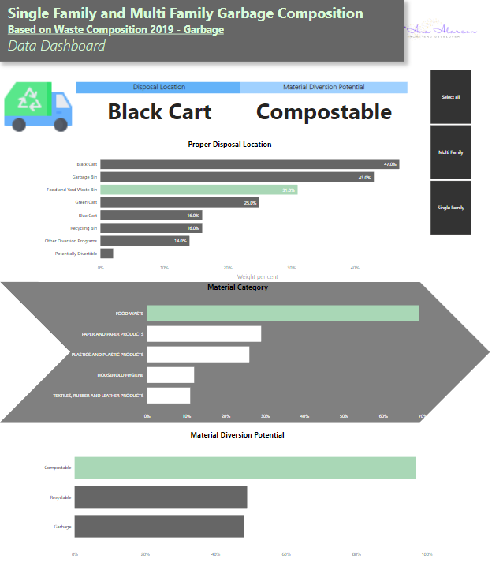

<h1 align="center">Hi 👋, I'm Ana Joselyn Alarcon</h1>
<h3 align="center">Enthusiastic Front-End Developer</h3>

- 🔭 I’m currently working on [Data extraction in Python and visualization in Power BI](https://github.com/AnaJoselynAlarcon/Calgary-single-and-Multi-Family-Garbage-Composition/)

# Data Extraction from Open API and Visualization in Power BI

This repository provides an example of how to extract data from an Open API using Python and subsequently create a visualization in Power BI. The goal is to demonstrate a simple workflow for retrieving data programmatically and then leveraging a visualization tool to present meaningful insights.

## Contents

- [Introduction](#introduction)
- [Requirements](#requirements)
- [Data Extraction](#data-extraction)
- [Visualization in Power BI](#visualization-in-power-bi)
- [Usage](#usage)
- [Contributing](#contributing)

## Introduction

The project aims to showcase a step-by-step process of extracting data from an Open API using Python. It utilizes the requests library to interact with the API, retrieves the required data, and saves it in a structured format, such as JSON or CSV.

Following the data extraction, the project demonstrates how to leverage Power BI for data visualization. Power BI is a powerful tool that allows users to connect to various data sources, create interactive visualizations, and generate insights from the data.

## Requirements

To run the code and replicate the visualization, you need the following:

- Python 3.x
- Python requests library
- Power BI Desktop

## Data Extraction

The data extraction process involves the following steps:

1. Identify the Open API endpoint and the data you want to retrieve.
2. Use the requests library in Python to send HTTP requests to the API and obtain the data.
3. Extract the relevant information from the API response.
4. Store the extracted data in a structured format, such as JSON or CSV.

In this repository, you will find a Python script (`connectedData.py`) that demonstrates how to extract data from an Open API using the requests library. You can modify the script according to your specific API requirements.

## Visualization in Power BI

Once the data extraction is complete and you have the data in a structured format, you can proceed with visualizing it in Power BI. Power BI provides a user-friendly interface to connect to various data sources, create interactive visualizations, and build comprehensive reports and dashboards.

To visualize the extracted data in Power BI:

1. Launch Power BI Desktop.
2. Connect to the extracted data source (e.g., JSON or CSV file).
3. Design and customize visualizations using Power BI's intuitive interface.
4. Create interactive reports, dashboards, and presentations.
5. Share your visualizations with others using Power BI's collaboration features.

In this repository, you will find a sample Power BI file (`visualization.pbix`) that demonstrates how to import and visualize the extracted data. Feel free to customize and enhance the visualization based on your specific data and requirements.

## Usage

To use this repository, follow these steps:

1. Clone the repository to your local machine using Git or download it as a ZIP file.
2. Install the required dependencies (Python requests library, Power BI Desktop).
3. Modify the `connectedData.py` script to match your specific API and data extraction needs.
4. Run the `connectedData.py` script to retrieve and store the data.
5. Launch Power BI Desktop and open the `Family Garbage.pbix` file.
6. Connect the visualization file to the extracted data source.
7. Customize and enhance the visualizations based on your requirements.
8. Save and share your Power BI visualization as desired.

## Contributing

Contributions to this repository are always welcome. If you have any improvements, suggestions, or bug fixes, please feel free to submit a pull request or open an issue.

<h3>  Chart 1: Proper Disposal Location by Weight Percentage </h3>

<h4>This bar chart represents the weight percentage of waste disposed of in different locations, specifically the black cart, green cart, and blue cart. The y-axis displays the disposal locations, while the x-axis represents the weight percentage. The black cart, indicated by the highest bar, represents the largest percentage of waste. The data in this chart is derived from a dataset that focuses on Black Cart and garbage bin waste from residential dwellings. It encompasses the pooled average of samples collected in 18 communities throughout the four seasons of 2019, amounting to 72 samples. The communities selected for sampling represent a diverse range of housing types and demographics in Calgary. </h4>

<h3> Chart 2: Material Category by Weight Percentage </h3>

<h4>This bar chart illustrates the weight percentage of waste based on different material categories. The y-axis represents the material categories, including food waste, paper and products, plastic, household hygiene, and textiles. The x-axis showcases the weight percentage. The chart is constructed using data from the waste composition studies conducted by Waste and Recycling Services. The dataset captures the average weight percentage composition of material categories obtained from samples collected in the four seasons of 2019. The material categories depicted in this chart highlight the top five contributors to the waste stream. </h4>

<h3> Chart 3: Material Diversion Potential by Weight Percentage </h3>

<h4> This bar chart presents the weight percentage of materials with potential for diversion, categorized as compostable, recyclable, and garbage. The x-axis represents the different material types, namely compostable, recyclable, and garbage, while the weight percentage is displayed on the y-axis. The data used to generate this chart is derived from the waste composition studies conducted by Waste and Recycling Services. The weight percentage composition reflects the potential for diverting materials from the waste stream. According to the dataset, compostable materials exhibit the highest diversion potential at 97%, followed by recyclable materials at 49%, and garbage at 48%. The insights gathered from this chart aid in evaluating the performance of diversion and education programs, facilitating the enhancement and design of new waste management initiatives. </h4>

- 📝 I regularly write posts on [https://www.linkedin.com/in/anajoselynalarcon/](https://www.linkedin.com/in/anajoselynalarcon/)

- 📫 How to reach me **ana.alarconfigueroa@edu.sait.ca**

<h3 align="left">Connect with me:</h3>

<h3 align="left">Languages and Tools:</h3>

           

